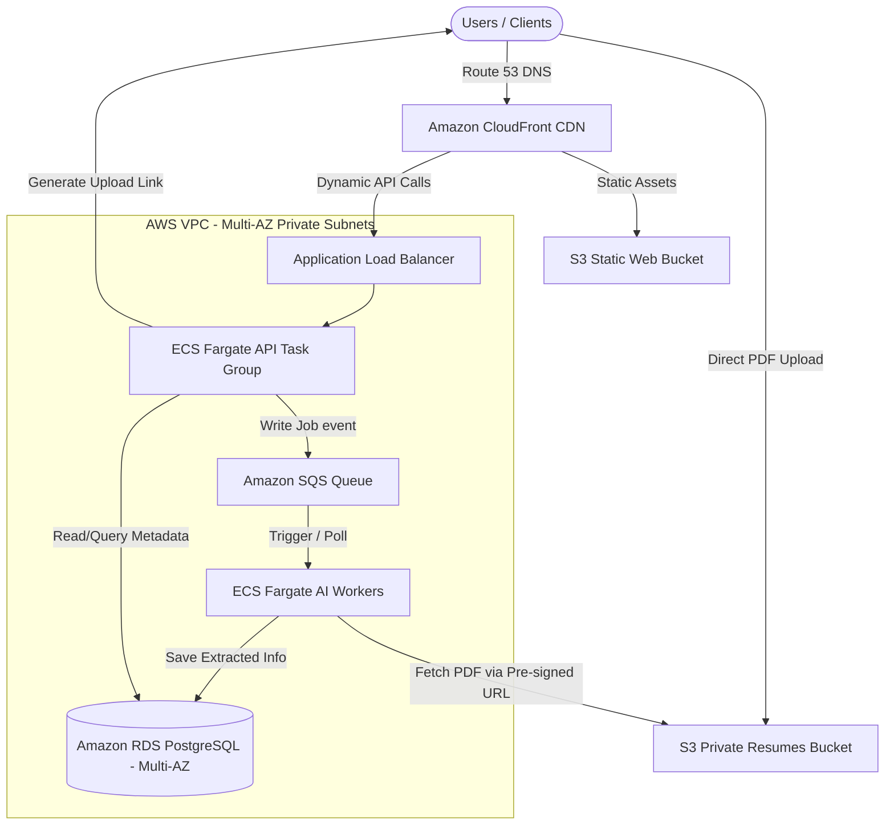

# 🚀 SyncUp – DevOps Intern Technical Assignment

This repository contains the submission for the **AWS DevOps Engineer Internship** technical assignment. It has been reformed into a professional, presentable developer portfolio structure suitable for showcase on GitHub.

---

### 👤 Submission Details
* **Candidate:** Sanvith JS
* **Role Applied For:** AWS DevOps Engineer Internship
* **Target Company:** SyncUp
* **Submission Date:** May 2026

---

## 📂 Repository Structure

The project has been organized to adhere to modern repository layout standards:

```text
mymraid/
├── docs/
│   ├── assignment_answers.md                           # 📝 Formatted markdown containing complete written answers
│   ├── assignment_answers.pdf                          # 📄 Original PDF submission
│   └── SyncUp – DevOps Intern Technical Assignment.docx # 📂 Original DOCX assignment file
├── .gitignore                                          # ⚙️ Minimal configuration ignoring OS and IDE temp files
└── README.md                                           # 🏠 Portfolio landing page (this document)
```

---

## 🛠️ Key Technologies & Concepts Covered

This assignment demonstrates a deep understanding of core DevOps, Cloud Infrastructure, and System Administration principles:
* **Cloud Infrastructure (AWS):** VPC (Multi-AZ), ECS Fargate, ALB, Route53, CloudFront, RDS, S3, KMS, SQS, IAM (Least Privilege).
* **Containerization & Networking:** Docker, Docker Compose, bridge networks, port bindings, DNS resolution.
* **CI/CD Pipelines:** GitHub Actions, AWS Elastic Container Registry (ECR), rolling updates, container health checking.
* **Linux & DB Operations:** OOM-killer debugging (`dmesg`, `syslog`), swap space allocation, WiredTiger cache limits, PostgreSQL/MongoDB.
* **Infrastructure as Code (IaC):** Terraform configuration mapping AWS components.

---

## 📝 Assignment Quick Links & Summary

For a deep-dive, read the complete [Assignment Answers Document](docs/assignment_answers.md). Below is a summary of the scenarios and technical solutions provided:

### [Part 1: Git & Deployment Debugging](docs/assignment_answers.md#part-1-git--deployment-debugging)
* **Scenario:** Server pulled latest changes from `main` but continues serving old code.
* **Core Solutions:**
  * Diagnosed common pitfalls: un-restarted processes (PM2/systemd), missing build steps (`npm run build`), missing dependency installations, or detached HEAD states.
  * Prescribed exact debugging commands using `git status`, `netstat`, `pm2 status`, and file modification timestamps.
  * Recommended moving away from direct server pulls to image-based registries (e.g. AWS ECR) where servers pull pre-built tagged Docker images.

### [Part 2: AWS S3 & IAM Permissions](docs/assignment_answers.md#part-2-aws-debugging)
* **Scenario:** Backend Node.js API receives `AccessDenied` error from S3 bucket despite successful frontend uploads.
* **Core Solutions:**
  * Step-by-step verification using AWS CLI commands (`aws sts get-caller-identity`, `aws s3 cp`), KMS decryption configuration checks, and CloudTrail event lookups.
  * Detailed the difference between IAM Users (static credentials, insecure for servers) and IAM Roles (temporary, auto-rotating credentials).
  * Provided a Terraform script snippet configuring the **least-privilege IAM Policy** restricting access strictly to target paths.
  * Proposed the secure production pattern: Frontend direct-upload via backend-generated **S3 Pre-signed URLs**.

### [Part 3: Linux System Administration & MongoDB Tuning](docs/assignment_answers.md#part-3-server-failure-investigation)
* **Scenario:** A `t2.micro` instance running MongoDB and a backend Docker container crashes daily at 7 PM.
* **Core Solutions:**
  * Identified memory starvation due to MongoDB's WiredTiger engine cache (which defaults to 50% of RAM - 1GB, conflicting with the backend process on a 1GB limit), scheduled cron jobs, and CPU credit exhaustion.
  * Provided kernel monitoring commands using `dmesg -T` and `/var/log/syslog` to catch `oom-killer` events.
  * Recommended mitigations: allocating 2GB swap space, restricting WiredTiger cache limits in `mongod.conf`, and migrating database workloads to a managed database like Amazon RDS.

### [Part 4: Docker Container Networking](docs/assignment_answers.md#part-4-microservice-communication)
* **Scenario:** Service A cannot communicate internally with Service B inside Docker despite Service B being accessible from the host server.
* **Core Solutions:**
  * Resolved the loopback binding issue: Inside a container, `localhost` points to itself, not to other services in the network.
  * Addressed binding rules: Service B must listen on `0.0.0.0` (all interfaces) rather than loopback `127.0.0.1`.
  * Configured a custom Docker bridge network in `docker-compose.yml` to enable internal DNS resolution by container service names.

### [Part 5: Production-Ready CI/CD Pipelines](docs/assignment_answers.md#part-5-cicd-thinking)
* **Scenario:** Transitioning from risky manually executed ssh build commands (`git pull && docker-compose down && docker-compose up --build`).
* **Core Solutions:**
  * Identified production hazards: build downtime, compile resource exhaustion on production servers, and lack of rollback safety.
  * Proposed a modernized CI/CD workflow utilizing pre-built immutable images tagged with specific Git commit SHAs.
  * Showcased safe deployment practices: container health check gates and using `docker-compose pull && docker-compose up -d` for near-zero-downtime rolling updates.

### [Part 6: Real Thinking Round](docs/assignment_answers.md#part-6-real-thinking-round)
* **Strategic QA:** Covers database recovery trade-offs (silent data corruption vs downtime), connection pool leaks, database schema migration safety, and system latency diagnoses (I/O wait, block locks, DNS latency).

---

## 🌟 Bonus Challenge: Scalable AWS Architecture Design

To handle **100,000 users**, daily zero-downtime deployments, and resource-heavy resume processing, the following cloud topology is designed:

### 🏛️ Topology Diagram



### 📋 Architectural Highlights
1. **Frontend Assets:** Delivered via **Amazon CloudFront** globally, caching static resources and reducing load on application servers.
2. **Compute Tier:** Leverages **AWS ECS Fargate** across multiple Availability Zones (AZs) for serverless container orchestration, scaling automatically according to API demand.
3. **Decoupled AI Processing:** The resume parsing engine is decoupled from the main web server using **Amazon SQS**. Heavy PDF parsing workloads run asynchronously on dedicated worker tasks, preventing traffic spikes from affecting user API latency.
4. **Data Tier:** Stored securely in a **Multi-AZ Amazon RDS PostgreSQL** instance with automated replication, failover, and daily backups.
5. **Secure File Uploads:** Bypasses backend compute layers entirely by utilizing **S3 Pre-signed URLs**, allowing secure, direct client-to-bucket uploads.

---

*For detailed configurations, terminal command scripts, and IAM policy code blocks, please view the [Full Assignment Answers document](docs/assignment_answers.md).*
