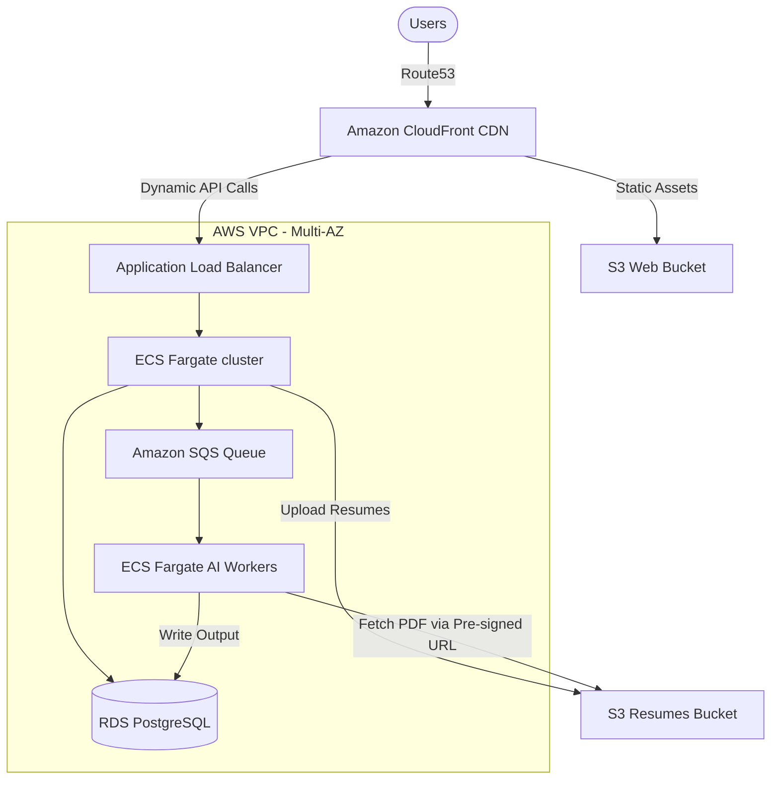

# SyncUp – DevOps Intern Technical Assignment

**Submitted by:** Sanvith JS
**Role:** AWS DevOps Engineer Internship

---

## Part 1: Git & Deployment Debugging

**Scenario:** A developer pulled latest changes from `main` on the server, but the application is still serving old code.

### Why this happens

When code is pulled but the running application doesn't reflect it, it is usually due to one of these reasons:

1. **Application Process Not Restarted:** The new code exists on disk, but the active process manager (PM2, systemd, or Docker) is still running the old version loaded in memory.
2. **Skipped Build/Compilation Step:** For compiled or transpiled runtimes (TypeScript, Go, React), the compilation step wasn't run. The web server continues to serve old files from the `dist/` or `build/` folder.
3. **Missing Dependency Updates:** The pull introduced new dependencies in `package.json` or `go.mod`. Since package installation (`npm install`) was skipped, the app failed to run the new modules or fell back.
4. **Detached HEAD or Uncommitted Conflicts:** The repository on the server is in a detached HEAD state, or a silent merge conflict prevented the `git pull` from actually applying the new commits.
5. **Caching Layers:** Stale assets are cached at the CDN (CloudFront), reverse proxy (Nginx), or in the browser itself.
6. **Orphaned Process / Port Binding:** The previous instance of the app crashed or hung but didn't release the port. The new process failed to start up, leaving the old zombie process running.

### How I'd debug it

Here is the order of steps I would take to confirm the root cause:

#### 1. Verify Git State
First, I'll confirm that the code actually made it to the disk:
```bash
# Check branch status and look for merge conflicts/detached HEAD
git status
git branch

# Verify that the active HEAD matches the target commit SHA
git rev-parse HEAD
git log -1 --stat
```

#### 2. Check Process Uptime
Compare the process start time with the git pull timestamp to see if a restart was missed:
```bash
# For PM2 managed apps
pm2 status

# For systemd services
systemctl status node-app
journalctl -n 50 -u node-app
```
*Indicator:* If the process uptime is longer than the time since the git pull, a restart is required.
*Fix:* Run `pm2 restart <app-name>` or `sudo systemctl restart node-app`.

#### 3. Inspect Build Outputs
For compiled apps, check if the build artifacts are fresh:
```bash
# Check modification times of build files
ls -lt dist/ | head -n 5
```
*Indicator:* If file timestamps are older than the git pull, re-run the build (`npm run build`).

#### 4. Check for Port Bindings and Hung Processes
```bash
# Find what process is actually listening on the port (e.g., 3000)
netstat -tulpn | grep :3000
# Or using modern ss tool
ss -tulpn | grep :3000
```

### Production Deployment Strategy
To move away from manual server pulls:
* **Immediate Rollback Priority:** If the latest deployment is suspected and user impact is high, I would prioritize rollback first before deep debugging to restore service quickly.
* **Pipeline-Based Flow:** Build and test Docker images in a CI pipeline (such as GitHub Actions) off-server. Tag the image with the specific Git commit SHA (e.g., `app:sha-8a4f10c`) and push it to a registry like Amazon ECR. 
* **Promotion:** Deploy by pulling that exact same tested image across staging and production. This prevents differences between build environments and makes rollbacks instantaneous (just pull the previous SHA tag).

---

## Part 2: AWS Debugging

**Scenario:** The frontend can upload files to S3 successfully, but the backend Node.js API receives an `AccessDenied` error when trying to access them.

### Debugging Steps

To isolate the issue under pressure, I would run these tests in order:

#### 1. Confirm Caller Identity
Check what IAM credentials the backend API is actually using to execute requests:
```bash
aws sts get-caller-identity
```
Verify that the output matches the expected EC2 Instance Profile or ECS Task Role.

#### 2. Run an Isolated Test from the Server
Attempt a manual S3 copy command using the AWS CLI from the backend host:
```bash
aws s3 cp s3://syncup-resumes/sample.pdf /tmp/test.pdf
```
* **If it succeeds:** The IAM role and network paths are correct. The bug is in the Node.js application configuration (e.g., hardcoded region, wrong bucket name in environment variables, or outdated SDK initialization).
* **If it fails with AccessDenied:** The issue is a pure AWS permission block.

#### 3. Check CloudTrail Logs
```bash
aws cloudtrail lookup-events --lookup-attributes AttributeKey=EventName,AttributeValue=GetObject --max-results 5
```
This helps identify whether the rejection is coming from a missing IAM permission or a bucket policy restriction.

### Potential causes
1. **Missing IAM Permissions:** The IAM role attached to the server lacks `s3:GetObject` permission for the specific bucket resource path.
2. **KMS Decryption Block:** The S3 bucket is encrypted using a KMS Customer Managed Key (CMK), and the backend role doesn't have permissions to decrypt using that key (`kms:Decrypt`).
3. **Bucket Policy Restrictions:** The S3 bucket policy explicitly restricts access (e.g., only allowing requests from a specific subnet or account), blocking the backend.

### S3 Security & Best Practices

* **IAM User:** Permanent credentials (access/secret keys). These should never be stored on servers or in `.env` files due to leakage risks. Secrets should be stored in AWS Secrets Manager or environment-injected securely instead of hardcoding them in repositories.
* **IAM Role:** Temporary, auto-rotating credentials assumed by AWS services (EC2/ECS). This is the safest way to authorize backend apps.
* **Bucket Policy:** A policy attached directly to the bucket. Useful for restricting access to specific networks.
* **Pre-signed URL:** A cryptographically signed link with a short expiration time. 

#### Recommended Production Pattern:
For security and scalability, the frontend should request a short-lived **Pre-signed URL** from the backend. The frontend then uploads the file directly to S3, bypassing the backend. The backend accesses S3 using an **IAM Role** with least-privilege permissions configured via Terraform:

```hcl
resource "aws_iam_role_policy" "s3_read_policy" {
  name = "s3-resumes-read-only"
  role = aws_iam_role.backend_role.id

  policy = jsonencode({
    Version = "2012-10-17"
    Statement = [
      {
        Effect   = "Allow"
        Action   = ["s3:GetObject"]
        Resource = "arn:aws:s3:::syncup-resumes/*"
      }
    ]
  })
}
```

*Note: During incident investigations, I would avoid exposing debugging endpoints or printing sensitive backend logs publicly to keep the environment secure.*

---

## Part 3: Server Failure Investigation

**Scenario:** A `t2.micro` instance (1 vCPU, 1GB RAM) running MongoDB locally and a Dockerized backend crashes daily around 7 PM.

### Incident Management Philosophy

During production incidents, restoring stability safely is usually more important than immediately applying aggressive fixes. 

1. **Understand Blast Radius:** Before applying fixes, I would first check whether the issue affects only one service or the entire deployment pipeline.
2. **Evidence Preservation:** Before restarting containers or rebooting the server, I would collect logs, metrics, and container states. Restarting may temporarily clear memory or release locks, hiding the original failure condition (evidence preservation).
3. **Reproduce & Confirm:** Before changing infrastructure or restarting services, I would first try to reliably reproduce the issue and confirm the failure pattern.
4. **One Change at a Time:** I would make one production change at a time and verify its impact before proceeding further. I would avoid making multiple infrastructure changes simultaneously during an incident because it makes it difficult to identify which change resolved or worsened the issue.
5. **Stabilize First, Fix Permanently Later:** 
   * **Temporary Mitigations:** Adding swap space, scaling the instance size temporarily, or scheduling container restarts.
   * **Permanent Fixes:** Fixing the underlying memory leaks, optimizing slow queries, database separation, and setting up proper autoscaling.
   * *Strategy:* I would first stabilize production, then investigate the root cause permanently.
6. **Postmortem Documentation:** After resolving the issue, I would document the root cause, mitigation steps, and preventive actions so future incidents can be resolved faster.

### What could cause this?
1. **OOM due to Scheduled Cron Jobs:** A daily backup, database indexing, or log cleanup runs at 7 PM, spiking memory past 1GB and triggering the Linux OOM-killer.
2. **MongoDB Memory Starvation:** MongoDB's default WiredTiger storage engine allocates 50% of (RAM - 1GB). On a 1GB instance, this causes severe memory contention between MongoDB and the Node.js backend.
3. **CPU Credit Exhaustion:** The `t2.micro` is a burstable instance. High traffic during the day drains its CPU credits, forcing the CPU to throttle down to baseline (10%) by 7 PM, freezing the system.
4. **Application Memory Leak:** A slow memory leak accumulates over hours of operation until the process hits the 1GB threshold and crashes.
5. **Daily Traffic Spikes:** A 7 PM marketing email or daily notification triggers a traffic spike that overwhelms the single-core instance.
6. **Disk Space Exhaustion:** Docker logs or database journals fill up the root volume, causing writes to fail and crashing the runtime.
7. **Heavy Log Rotation Disk I/O:** Log rotation running uncompressed at 7 PM saturates the EBS disk I/O bandwidth, causing connection timeouts.

### Commands I'd run

#### 1. Look for Out-Of-Memory (OOM) Events
```bash
# Check dmesg for kernel OOM-killer messages
dmesg -T | grep -i -E "oom-killer|killed process"

# Check system syslog files
grep -i "out of memory" /var/log/syslog
journalctl -xe --since "18:50" --until "19:10"
```

#### 2. Correlate Events and Metrics
I would correlate deployment timestamps, traffic spikes, cron schedules, and system metrics around 7 PM to identify patterns.
```bash
# Check system cron schedules
cat /etc/crontab
crontab -l

# Check active disk utilization
df -h
du -sh /var/lib/docker/*
```

#### 3. Monitor Resource Usage
```bash
# Check swap allocation and memory free details
free -h
docker stats --no-stream
```

### Mitigation & Monitoring

* **Immediate Workaround:** Add a 2GB Swap space on the EBS volume to act as a buffer against memory spikes.
* **Database Separation:** Migrate MongoDB off the application server to a managed service like AWS RDS (or DocumentDB) using Terraform. Before major deployments or schema changes, I would ensure recent backups are available and verified.
* **Configure MongoDB Cache Limits:** If MongoDB must run locally, explicitly restrict WiredTiger cache limits in `mongod.conf`:
  ```yaml
  storage:
    wiredTiger:
      engineConfig:
        cacheSizeGB: 0.25
  ```
* **Monitoring Philosophy:** Focus on actionable alerts instead of noisy notifications to prevent alert fatigue. I would set up CloudWatch or Grafana alerts for:
  * Sustained memory pressure (> 85% for 5 mins)
  * Disk utilization (> 80%)
  * Abnormal container restart frequency
  * Elevated HTTP 5xx error rates

---

## Part 4: Microservice Communication

**Scenario:** Service A cannot communicate with Service B inside Docker. `curl http://localhost:5000` from the host server works fine, but internal calls fail.

### Root Causes & Docker Networking

1. **Incorrect Loopback Binding (`localhost`):** Service A is configured to call `http://localhost:5000`. Inside Service A's container, `localhost` refers to itself, not Service B.
2. **Service B Binding to localhost:** Service B is configured to listen on `127.0.0.1` inside its container. It will reject any traffic originating from outside its container (such as Service A). It must bind to `0.0.0.0`.
3. **Default Bridge Network Limitations:** In Docker, containers on the default bridge network cannot resolve each other by container/service name. A user-defined bridge network is required for automatic DNS resolution.
4. **App Readiness vs Container Status:** A container being "running" does not necessarily mean the application inside is healthy and ready to accept connections. A process can be alive but still not ready to serve production traffic. Service A might attempt connection before Service B's runtime is fully initialized.
5. **Host-Level Firewall Rules:** I would also verify firewall/security group rules if containers span multiple hosts. Sometimes internal networking or host-level firewalls (like iptables/UFW) block inter-container communication on custom bridge interfaces.

### How to debug

To diagnose connectivity from Service A:
```bash
# Test internal DNS resolution
docker exec -it service-a nslookup service-b

# Test TCP socket connection to Service B on port 5000
docker exec -it service-a nc -zv service-b 5000

# Inspect Docker networks
docker network ls
docker inspect service-a
```

### Fix
Define a custom bridge network in `docker-compose.yml` to enable automatic DNS discovery, and ensure Service B binds to `0.0.0.0`:

```yaml
version: '3.8'

services:
  service-a:
    image: app-service-a:sha-a87f1c
    environment:
      - SERVICE_B_URL=http://service-b:5000
    networks:
      - app-network

  service-b:
    image: app-service-b:sha-b34e2f
    environment:
      - PORT=5000
      - HOST=0.0.0.0
    networks:
      - app-network

networks:
  app-network:
    driver: bridge
```

---

## Part 5: CI/CD Thinking

**Scenario:** Deployment is done by SSHing into the server and running:
`git pull` -> `docker-compose down` -> `docker-compose up -d --build`

### What's wrong with this approach?
* **Guaranteed Downtime:** `docker-compose down` stops the running containers immediately, taking the application offline while the new image builds.
* **No Fallback on Build Failure:** If the build fails (e.g., due to failing dependency installations), the old containers are already destroyed, leaving the system offline until resolved.
* **Server Resource Exhaustion:** Building Docker images directly on the production host consumes heavy CPU and RAM, impacting any other running processes.
* **Security Exposure:** Keeping Git SSH keys or access tokens on the production host exposes the code repository if the server is ever compromised.

### Rebuilding the Deployment Pipeline
To achieve safer and faster deployments:
1. **Immutable Artifacts:** I prefer immutable deployments where the exact same tested image is deployed across staging and production instead of rebuilding separately on production.
2. **Reversible Deployments:** Production deployments should ideally be reversible within minutes. I would avoid using mutable tags like `latest` in production deployments because it makes rollback tracking unreliable.
3. **Minimize Downtime:** Run `docker-compose pull` beforehand to download pre-built images. When running `docker-compose up -d`, Docker will recreate containers with minimal interruption instead of tearing the entire stack down first.
4. **Smoke Testing & Gated Traffic:** Implement a basic health check and run a quick smoke test locally to verify application readiness before routing public traffic. Health checks should gate traffic routing so unhealthy containers do not receive production requests.

```yaml
services:
  web:
    image: 123456789012.dkr.ecr.us-east-1.amazonaws.com/syncup-api:${IMAGE_TAG}
    healthcheck:
      test: ["CMD", "curl", "-f", "http://localhost:5000/healthz"]
      interval: 10s
      timeout: 5s
      retries: 3
```

---

## Part 6: Real Thinking Round

### Q1. What is more dangerous: server downtime or silent data corruption? Why?
**Silent data corruption is much more dangerous.** 
Downtime is immediate and visible; monitoring alerts fire, and engineers know what to fix. Silent data corruption can go unnoticed for weeks, polluting databases and active backups. Recovering and reconciling corrupted financial or user data after the fact is extremely complex and damages user trust.

### Q2. A server works perfectly after restart but fails again after a few hours. What does this indicate?
This points to a **resource exhaustion issue accumulating over time**:
* **Memory Leak:** The application is accumulating objects in memory without garbage collecting, eventually hitting the limit and triggering OOM.
* **Connection Pool Leak:** Database connections are opened but never closed. Once the application hits the database's max connection limit, it hangs.
* **Disk/Log Accumulation:** Log files are writing rapidly and filling up the disk space within hours.

### Q3. When should you NOT automate deployment?
* **Destructive Schema Migrations:** Major database changes (like dropping columns or locking heavy tables) require manual observation, dry-runs, and verify-before-apply steps. Before major deployments or schema changes, I would ensure recent backups are available and verified.
* **Destructive IaC Changes:** Terraform plans that indicate destruction/recreation of critical database instances or subnets should halt for manual engineer review.

### Q4. If CPU is normal but website is slow, what could be wrong?
This indicates that the application is waiting on external I/O blocks:
1. **Database Locks/Queuing:** Queries are waiting for a lock on a table to release.
2. **Slow Third-Party API calls:** The server is making blocking external network requests with high timeout limits.
3. **Disk I/O Bottlenecks (EBS IOPS limit):** The server is waiting on slow disk reads/writes.
4. **Node.js Event Loop Blocking:** A synchronous heavy CPU task blocks the single thread, preventing it from handling other requests (while overall CPU remains low).
5. **DNS Resolution Latency:** Outgoing requests are slow because the host DNS resolver is misconfigured, causing every lookup to take several seconds.

---

## Bonus Challenge: Scalable Infrastructure

To handle 100,000 users, daily deployments, and resume processing, I designed this architecture:

### 1. Architecture Topology Diagram


### 2. High-Availability & Compute Design
* **ECS Fargate:** Web servers run across multiple availability zones (AZs) behind an Application Load Balancer. It scales horizontally based on request counts and CPU utilization.
* **Asynchronous AI Workers:**
  1. Frontend uploads resumes directly to **S3** via a **Pre-signed URL** generated by the API.
  2. The API sends a job message to an **Amazon SQS Queue**. Using SQS decouples traffic spikes from backend processing and prevents AI workloads from overwhelming the main API.
  3. A dedicated fleet of **ECS Fargate AI Workers** polls SQS, processes the files asynchronously, and updates RDS when done.
  * *Benefit:* This prevents slow, CPU-heavy AI parsing from impacting web API response times. If a job fails, SQS handles retries automatically.

### 3. Data & Storage
* **Amazon RDS PostgreSQL:** Multi-AZ configuration for automated failover.
* **IAM Least Privilege:** ECS tasks are assigned fine-grained IAM execution roles. The Web API has SQS write access, while the AI workers only have read access.

---

## Assumptions Made
* The backend is Node.js-based.
* Docker Compose is used in local/staging environments.
* The S3 bucket is private by default.
* The Linux distribution is Ubuntu-based.
* CI/CD is orchestrated via GitHub Actions.
